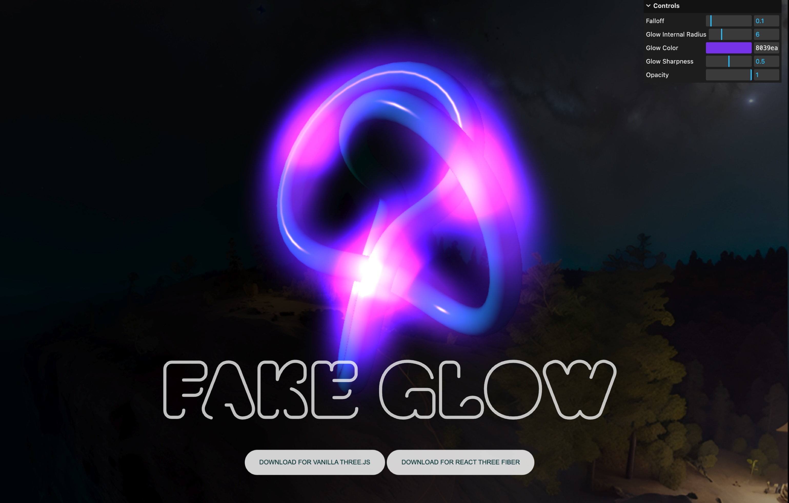

# Fake Glow Material for Vanilla Three.js

A simple-to-use Fake Glow material for threejs

<p align="center">
   
</p>

Live link: <a href="https://fake-glow-material-threejs.vercel.app/" target="_blank">https://fake-glow-material-threejs.vercel.app/</a>

# Introduction

This material enables the utilization of a 3D mesh as a GLOW effect through GLSL Shaders, all without the need for any post-processing effects.

Unlike traditional approaches using post-processing, my new React Three Fiber material employs GLSL Shaders directly for creating glow effects on 3D meshes. This method avoids the usual performance hit associated with post-processing, such as the bloom effect, making it a more efficient solution for integrating glow effects in 3D scenes.

# HOW TO USE?

### 1: Download the Material

Create a new file with the contents of [this gist](https://gist.github.com/ektogamat/4bc0035ed0702c6de3bab558658f9c84) on your project and save it as 'FakeGlowMaterial.js'

### 2: Import the material

```
import FakeGlowMaterial from './FakeGlowMaterial.js'
```

### 3: Add this as a material for your mesh

```
// ...
const geometry = new THREE.SphereGeometry();
const FakeGlowMaterial = new FakeGlowMaterial();
const Sphere = new THREE.Mesh(geometry, FakeGlowMaterial);
scene.add(Sphere);
// ...

```

That's all that you need to use this material. Of course, you can customize it as shown below.

### This effect is mesh based, meaning that you need to provide a mesh for this to work properly

<p align="center">
    
</p>

When you give it a mesh, remember that it must be smooth enough so glsl can calculate normals and create the effect. For example, for sharp meshes like a cube, you can use a sphere to simulate the glow, instead of a copy of the cube.

| ❌ Bad: Cube mesh for glow | ✅ Good: Sphere mesh for glow |
| :------------------------: | :---------------------------: |
|   |      |

# Properties

| Name               | Type                                              | Default   | Description                                                                                                                          |
| ------------------ | ------------------------------------------------- | --------- | ------------------------------------------------------------------------------------------------------------------------------------ |
| falloff            | Number                                            | 0.1       | Controls the falloff factor for the glow effect. Ranges from 0.0 to 1.0.                                                             |
| glowInternalRadius | Number                                            | 6.0       | Controls the internal radius for the glow effect.                                                                                    |
| glowColor          | String or Color                                   | "#00d5ff" | Specifies the color of the glow effect. Use hexadecimal format or a `THREE.Color` instance.                                          |
| glowSharpness      | Number                                            | 0.5       | Controls the sharpness of the glow effect. Ranges from 0.0 to 1.0.                                                                   |
| opacity            | Number                                            | 1.0       | Specifies the opacity of the hologram. Ranges from 0.0 to 1.0.                                                                       |
| side               | THREE.FrontSide, THREE.BackSide, THREE.DoubleSide | FrontSide | Specifies the rendering side. Options are "THREE.FrontSide", "THREE.BackSide", or "THREE.DoubleSide". Defaults to "THREE.FrontSide". |
| depthTest          | Boolean                                           | false     | Enables or disables depth testing. Defaults to false.                                                                                |

Here is an example of how you can pass these props. If you pass any of those props, the default values will be overwritten.

```
const fakeGlowMaterial = new FakeGlowMaterial({
    falloff: 0.2,
    glowInternalRadius: 6.0,
    glowColor: new THREE.Color("#ff0000"),
    glowSharpness: 0.7,
    opacity: 2.3,
    side: THREE.FrontSide,
    depthTest: true,
});

```

### License

This component is an open-source creation released under the (MIT) license. While you're free to integrate and innovate with it, I would genuinely appreciate knowing when this FakeGlowMaterial sparks creativity in your projects!

### Resources

Resources: [Threejs](https://threejs.org/), [WebGL](https://github.com/KhronosGroup/WebGL)

# Can you leave a star, please?

Would be really appreciated if you are willing to give me a star here on GitHub 🎉 or buy me a coffee ☕ https://www.buymeacoffee.com/andersonmancini. The money will be used to produce more content about threejs or to buy new courses.
